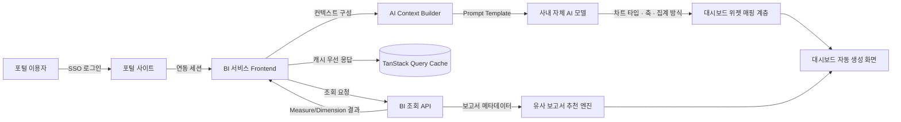
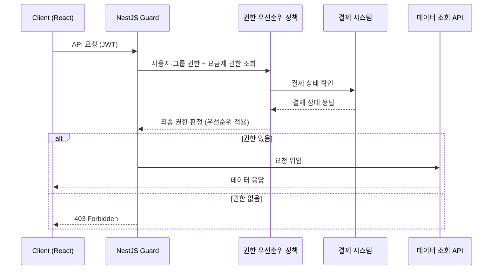
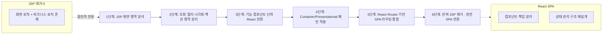
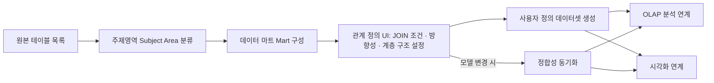

# 🏢 Career

㈜위세아이텍 WI Development Team에서 2020년 7월부터 현재까지 BI(Business Intelligence) 플랫폼을 개발하고 있습니다. 데이터 모델링 화면부터 SaaS 전환, AI 기반 분석 기능까지 BI 서비스의 전체 라이프사이클에 참여해 왔습니다.

각 프로젝트는 **배경 → 해결한 문제 → 구현 내용 → 성과** 순으로 정리했습니다. 회사 프로젝트 특성상 고객사 고유의 내부 시스템 명칭이나 데이터는 일반화하여 서술했습니다.

> 🧭 메인 포트폴리오로 돌아가기: [portfolio.md](./portfolio.md) · 성능 개선 상세: [performance.md](./performance.md)

---

## 목차

1. [AI 기반 BI 분석 지원 서비스](#ai-bi-analytics) `2025.08 ~ 현재`
2. [스포츠토토 BI 서비스 SSO 연동 및 안정화](#sportstoto) `2025.06 ~ 2026.02`
3. [BI 솔루션 SaaS 전환](#saas-migration) `2025.01 ~ 2025.08`
4. [홈앤쇼핑 전사 관리 지표 프로젝트](#homeshopping) `2024.06 ~ 2025.05`
5. [BI 플랫폼 레거시 현대화](#legacy-modernization) `2022.07 ~ 2023.12`
6. [BI 데이터 설계 플랫폼 개발](#data-design-platform) `2020.07 ~ 2022.06`

---

## 1. AI 기반 BI 분석 지원 서비스

**기간** 2025.08 ~ 현재 · **소속** ㈜위세아이텍 WI Development Team · **역할** Frontend 개발
**기술 스택** TypeScript, Next.js, React, TanStack Query, PostgreSQL

### 프로젝트 개요

기존 BI 서비스는 사용자가 조회 조건을 직접 설정하고, 그 결과를 보며 어떤 차트로 표현할지도 직접 골라야 했습니다. 이 프로젝트는 자체 AI 모델을 BI 조회·분석 과정에 결합해, **분석 결과 해석과 대시보드 구성을 자동화**하는 것을 목표로 진행하고 있습니다. 공공기관 포털 서비스와 BI를 연동해, 포털 이용자가 별도 학습 없이 분석 결과와 대시보드를 조회할 수 있는 화면도 함께 개발했습니다.

### 담당 역할

- 포털 서비스와 BI 서비스 간 연동 화면 및 데이터 연계 기능 개발
- BI 조회 결과 메타데이터를 활용한 AI 차트/대시보드 자동 생성 기능 개발
- 기존 보고서 메타데이터 기반 유사 보고서 추천 기능 구현
- AI 응답 품질을 높이기 위한 Prompt Template 설계 및 개선

### 해결한 문제

- **분석 결과 해석의 진입장벽**: BI 조회 결과(Measure/Dimension)를 봐도 어떤 시각화가 적합한지 판단하기 어려운 사용자가 많았습니다. 데이터 구조를 분석해 적합한 차트 유형을 AI가 추천하도록 하여 이 장벽을 낮췄습니다.
- **반복적인 보고서 작성 비용**: 유사한 목적의 보고서를 매번 처음부터 구성하는 비효율이 있었습니다. 기존 보고서의 메타데이터와 구성 정보를 활용해 유사 분석을 탐색·추천하는 기능으로 작성 시간을 단축했습니다.

### 구현 내용

- BI 조회 결과의 Measure/Dimension 구조를 분석해 AI에 전달할 컨텍스트를 구성하는 로직 설계
- AI 모델 응답을 대시보드 위젯(차트 타입, 축, 집계 방식)으로 변환하는 매핑 계층 구현
- TanStack Query 기반으로 AI 응답 대기 중에도 기존 조회 데이터를 캐시에서 즉시 보여주는 비동기 UX 설계
- Prompt Template을 목적(차트 추천 / 보고서 추천 / 대시보드 생성)별로 분리하여 응답 품질과 유지보수성 개선

### 포털 연동 BI 기능 고도화

AI 기능과 별개로, 공공기관 포털과 BI 서비스를 SSO로 연동하는 과정에서 대용량 상세 데이터 조회 시 반복되던 DB 커넥션 풀 고갈 문제를 발견해 세션 설정을 재점검하고 안정화했습니다. 드릴다운, 계산된 컬럼, 개인분석 설정 등 포털 이용자의 실사용 요청도 함께 반영해 분석 편의성을 높였습니다.

> TODO(Image): AI 기반 대시보드 자동 생성 화면 캡처

### 성과

- 사용자의 분석 목적과 데이터 구조에 맞는 시각화를 자동으로 제안해 BI 활용도 향상에 기여
- 반복적인 보고서 작성 과정을 자동화해 사용자의 보고서 작성 시간 단축
- 드릴다운, 계산된 컬럼 등 실사용 과정에서 발견된 기능 요구를 빠르게 반영해 포털 이용자의 분석 편의성 개선

---

## 2. 스포츠토토 BI 서비스 SSO 연동 및 안정화

**기간** 2025.06 ~ 2026.02 · **소속** ㈜위세아이텍 WI Development Team · **역할** Frontend 단독 담당
**기술 스택** React, DevExtreme(PivotGrid/DataGrid), SpreadJS, Spring

### 프로젝트 개요

스포츠토토 BI 서비스에 SSO(Single Sign-On) 인증을 연동하고, 피벗그리드·데이터그리드·SpreadJS 기반 보고서 기능의 안정성을 높인 유지보수 및 기능 개발 프로젝트입니다. 별도 팀 없이 프론트엔드를 단독으로 전담해, 설계부터 구현·배포·운영 대응까지의 의사결정을 직접 내렸습니다.

### 담당 역할

- 인증 흐름 설계부터 그리드 라이브러리 업그레이드 범위까지, 팀 협의 없이 단독으로 기술적 의사결정을 내리며 프로젝트 전 과정을 전담
- SSO 인증 연동 및 비상 로그인(Emergency Login) 기능 개발
- SpreadJS 17 → 18 버전 업그레이드 및 회귀 이슈 대응
- 피벗그리드/데이터그리드의 필터링·페이징·다운로드 기능 개선
- 외부 웹 취약점 점검 결과 대응(SQL Injection, Path Traversal) 및 조치

### 해결한 문제

**1) SSO 세션 장애 시 서비스 접근 불가**
SSO 인증 서버 장애나 세션 만료 상황에서 사용자가 BI 서비스에 접근하지 못하는 문제가 있었습니다. ssoToken 검증과는 별개로, 세션 정상 여부를 판단하는 API와 비상 로그인 경로를 설계해 인증 장애 상황에서도 서비스 접근이 가능하도록 했습니다.

**2) 대용량 그리드의 페이징·필터 오류**
셀 병합이 적용된 데이터그리드에서 페이징 시 데이터가 어긋나는 문제, 마스터 필터(Master Filter)가 하위 그리드에 정상적으로 반영되지 않는 문제 등이 반복적으로 보고됐습니다. 각 케이스를 재현해 원인을 특정하고 개별 수정했습니다.

**3) SpreadJS 라이브러리 노후화로 인한 반복 이슈**
구버전 SpreadJS에서 발생하던 다운로드·데이터 바인딩 관련 이슈를 근본적으로 해결하기 위해 18버전으로 업그레이드를 진행하고, 업그레이드 과정에서 발생한 회귀 이슈들을 대응했습니다.

**4) 외부 보안 점검에서 발견된 SQL Injection · Path Traversal 취약점**
외부 웹 취약점 점검에서 심각도 높은 취약점 두 건이 발견됐습니다. 상품별 발매정보 조회 API는 파라미터에 삽입한 쿼리의 참/거짓 응답 차이로 DB 데이터를 추출할 수 있는 Blind SQL Injection에 노출돼 있었고, 파일 다운로드 API는 경로 파라미터를 조작해 시스템 내 임의 파일에 접근할 수 있는 Path Traversal 취약점이 있었습니다.

- 조회 파라미터에 입력 검증·이스케이프 처리와 암호화를 적용해 SQL Injection 조치
- 파일명을 화이트리스트 정규식(`^[a-zA-Z0-9._-]+$`)으로 1차 검증하고, Canonical Path 비교로 기준 폴더 밖 접근을 차단해 Path Traversal 제거

### 구현 내용

- `feat/sso` 브랜치에서 SSO 인증 플로우와 비상 로그인 기능을 함께 구현
- SpreadJS 파일 저장·불러오기 시점에 로그를 남겨 운영 중 발생하는 이슈의 추적성 확보
- Between 필터 정렬, 피벗그리드 페이징 토글, 데이터그리드 항목별 가로 정렬 옵션 등 사용자 피드백 기반 UX 개선

> TODO(Image): 스포츠토토 BI 서비스 화면 캡처

### 성과

- SSO 연동과 비상 로그인 체계를 함께 구축해 인증 장애 상황에서도 서비스 연속성 확보
- 그리드 페이징·필터 관련 반복 오류를 다수 수정해 운영 안정성 향상
- 외부 보안 점검에서 발견된 SQL Injection·Path Traversal 취약점을 모두 직접 조치해 보안 위협 제거

---

## 3. BI 솔루션 SaaS 전환

**기간** 2025.01 ~ 2025.08 · **소속** ㈜위세아이텍 WI Development Team · **역할** Frontend 개발
**기술 스택** TypeScript, NestJS, TypeORM, React, Vite, Shadcn UI, DevExtreme, PostgreSQL

### 프로젝트 개요

구축형(On-premise)으로 고객사마다 개별 배포하던 BI 솔루션을 하나의 코드베이스로 여러 고객이 이용하는 SaaS 형태로 전환하는 프로젝트였습니다. 사용자·그룹 단위였던 기존 권한 체계에 **요금제 기반 권한**이 추가되면서 권한 조합의 경우의 수가 크게 늘었고, 이를 감당할 수 있는 구조 설계가 핵심 과제였습니다.

### 담당 역할

- 요금제·결제 상태 기반 권한 관리 시스템 프론트엔드 설계 및 구현
- 사용자 활동 로그 수집 API 및 운영 모니터링 대시보드 개발
- 초기 로딩 성능 개선 및 API 호출 구조 리팩터링
- 주니어 개발자 PR 코드 리뷰 및 React 렌더링 최적화 패턴(Zustand selector 분리, useMemo/useCallback 적용 기준 등) 온보딩 진행

### 해결한 문제

**1) API 호출 비효율과 Race Condition**
동일한 데이터를 여러 컴포넌트가 각자 조회하면서 중복 네트워크 트래픽이 발생했고, 권한 검증이 API 응답 이후에 이루어지다 보니 권한이 없는 데이터가 순간적으로 노출되는 Race Condition이 다수 발견됐습니다.

- Chrome DevTools Network 탭으로 화면 진입부터 사용자 액션 종료까지 발생하는 API 요청을 전수 추적
- API를 목적 단위(권한 확인 / 메타 정보 / 실제 데이터 조회)로 분류해 호출 책임을 명확히 분리
- `AbortController`를 활용해 이전 요청을 취소하고 최신 요청만 반영되도록 하여 Race Condition 해결

**2) 전역 상태 변경에 따른 화면 전체 리렌더링**
Zustand 스토어를 도메인 구분 없이 사용하다 보니, 일부 상태 변경에도 화면 전체가 리렌더링되는 문제가 있었습니다.

- React DevTools Profiler로 Commit 단위 렌더링 시간을 측정해 병목 컴포넌트 특정
- 전역/로컬 상태를 도메인 단위로 분리하고, 계산 비용이 큰 지점에만 `useMemo`/`useCallback`을 선택적으로 적용
- 입력 필터에 디바운싱을 적용해 타이핑마다 발생하던 불필요한 API 호출 제거

**3) 요금제 기반 권한 정책의 복잡도**
사용자·그룹 기반 권한에 요금제 권한이 더해지며 권한 우선순위 판단 로직이 화면 곳곳에 흩어져 있었습니다.

- NestJS Guard 기반 접근 제어 구조를 설계하고, 권한 우선순위 정책을 서버·클라이언트가 공유하는 단일 기준으로 표준화

### 구현 내용

- React Suspense·Lazy 기반 컴포넌트 로딩 구조 개선으로 초기 진입 속도 향상
- 사용자 활동 로그, 데이터 사용 현황, 기능 사용 이력 등을 수집·시각화하는 SaaS 운영 모니터링 대시보드 구현
- 외부 결제 시스템과 연동해 결제 상태를 조회하고 권한을 갱신하는 흐름 구현

> TODO(Image): SaaS 운영 모니터링 대시보드 화면 캡처

### 성과

- 불필요한 API 호출 제거 및 캐싱으로 월 API 호출 횟수 **32% 감소**
- 렌더링 병목 컴포넌트 최적화로 초기 렌더링 속도 및 화면 전환 성능 개선
- 필터 입력 등 잦은 인터랙션 구간의 응답성 향상 및 UI 지연 현상 감소

---

## 4. 홈앤쇼핑 전사 관리 지표 프로젝트

**기간** 2024.06 ~ 2025.05 · **소속** ㈜위세아이텍 WI Development Team · **역할** 프로젝트 리더 / Frontend 개발
**기술 스택** JavaScript, DevExtreme, React, ECharts, D3.js, SpreadJS, Oracle

### 프로젝트 개요

홈앤쇼핑의 전사 관리 지표를 OLAP 기반으로 조회·분석하는 시스템 개발 프로젝트로, 처음으로 프로젝트 리더 역할을 맡아 일정과 리스크를 관리했습니다. 대용량 비정형 보고서의 조회 속도와 렌더링 성능 개선이 핵심 과제였습니다.

### 담당 역할

- 프로젝트 리더로서 일정 산정, 리스크 관리, 우선순위 의사결정 주도
- OLAP 기반 신규 시각화 컴포넌트(3D Chart, 지도 시각화, 통계 분석 차트) 개발
- SpreadJS 기반 대용량 보고서 렌더링 성능 개선
- 고객사 요구사항에 맞춘 3단계 권한 체계 설계 및 구현 단독 담당

### 해결한 문제

**1) 프로젝트 리더 부재로 인한 운영 혼선**
일정 산정 기준이 명확하지 않고, 성능 이슈 대응 우선순위를 둘러싼 혼선이 반복되고 있었습니다.

- 기능별 예상 소요 시간과 리스크를 산정해 팀 단위 일정을 수립하고, 주요 리스크를 사전에 식별해 대응하는 체계를 구축

**2) 보고서 조회 지연과 UI 프리징**
주요 4종 비정형 보고서의 평균 조회 시간이 1분 30초~2분에 달했고, 스크롤이나 인터랙션 중 UI 프리징이 빈번하게 발생했습니다. SpreadJS로 대용량 데이터를 한 번에 그리려다 보니 DOM 노드 수가 과도하게 늘어나는 것이 근본 원인이었습니다.

- **Virtualized Rendering** 적용: 화면에 실제로 노출되는 행/열만 렌더링하고, 스크롤 위치에 따라 렌더링 범위를 동적으로 조절
- **Lazy Loading** 적용: 초기 진입 시 핵심 지표만 우선 로딩하고, 상세 데이터는 사용자 인터랙션 시점에 로딩
- **Memoization** 적용: 동일 조건 재조회 시 클라이언트 재연산을 방지하고, 데이터 가공 결과를 캐싱해 반복 계산 제거
- 약 10만 로우 규모의 데이터 가공 로직을 클라이언트에서 서버 사이드로 이동

```mermaid
flowchart TB
  subgraph before["❌ Before: 전체 렌더링"]
    B1["데이터 조회<br/>약 10만 Row"] --> B2["클라이언트에서<br/>전체 가공"]
    B2 --> B3["전체 Row를<br/>DOM에 렌더링"]
    B3 --> B4["DOM 노드 급증<br/>메인 스레드 점유 ↑"]
    B4 --> B5["스크롤 · 인터랙션 시<br/>UI 프리징"]
  end
  subgraph after["✅ After: Virtualized Rendering"]
    A1["데이터 조회<br/>약 10만 Row"] --> A2["서버 사이드<br/>데이터 가공"]
    A2 --> A3["Viewport 범위 계산"]
    A3 --> A4["보이는 행 · 열만<br/>렌더링"]
    A4 --> A5["스크롤 위치에 따라<br/>렌더링 범위 동적 갱신"]
    A5 --> A6["DOM 노드 최소화<br/>조회 시간 1분 이내"]
  end

  classDef bad fill:#fde2e2,stroke:#c0392b,color:#7a1f1f
  classDef good fill:#e3f6ea,stroke:#1e8449,color:#145a32
  class B1,B2,B3,B4,B5 bad
  class A1,A2,A3,A4,A5,A6 good
```

> TODO(Image): 3D Chart / 지도 기반 시각화 컴포넌트 화면 캡처

**3) 고객사 요구에 따른 커스텀 권한 체계 확장**
기존 그룹·사용자 2단계로 운영되던 권한 체계로는 홈앤쇼핑이 요청한 요구사항을 감당할 수 없었습니다. 전사 데이터를 총괄 열람할 슈퍼 권한과, 로그인 없이 조회만 가능한 상담원용 뷰어 권한이 추가로 필요했습니다.

- 그룹·사용자 2단계 권한 체계에 슈퍼 권한과 비로그인 뷰어 권한을 추가해 3단계 구조로 확장, 요구사항 정의부터 구현까지 단독 담당

### 구현 내용

- OLAP 기반 데이터 분석 요구사항에 대응하는 3D Chart, 지도 기반 시각화, 통계 분석 차트 등 신규 시각화 컴포넌트 개발
- Viewport 기준으로 렌더링 범위를 제한해 DOM 생성량과 메인 스레드 점유 시간을 줄이는 구조로 SpreadJS 렌더링 레이어 개선

### 성과

- 보고서 평균 조회 시간을 1분 30초~2분에서 **1분 이내**로 단축
- UI 프리징 현상 제거로 체감 성능 크게 개선, 이후 신규 지표 추가 시에도 성능 이슈 재발 최소화
- 리스크 사전 식별 체계 도입으로 개발 일정 약 **20% 단축**

---

## 5. BI 플랫폼 레거시 현대화

**기간** 2022.07 ~ 2023.12 · **소속** ㈜위세아이텍 WI Development Team · **역할** Frontend 개발
**기술 스택** React, NestJS, Spring, Redux Toolkit, Jenkins, GitHub Actions, Jest

### 프로젝트 개요

다년간 기능 위주로 확장되어 온 JSP 기반 BI 시스템을 React SPA 아키텍처로 전환한 프로젝트입니다. 단순히 화면을 옮기는 마이그레이션이 아니라, 디자인 패턴 학습을 바탕으로 한 **점진적 리팩터링**을 함께 진행해 코드 품질을 구조적으로 개선하는 데 집중했습니다.

### 담당 역할

- 전면 재작성 대신 점진적 전환 방식을 팀에 제안하고 관철시켜, 마이그레이션 전략에 대한 핵심 기술 의사결정을 주도
- React 점진적 마이그레이션 전략 수립 및 컴포넌트 단위 전환
- 리팩터링 기준·코드 컨벤션 문서화 및 팀 공통 규칙 정립
- 단위 테스트·E2E 테스트 도입 및 CI/CD 파이프라인 구축

### 해결한 문제

**1) 화면 로직과 비즈니스 로직의 혼재**
JSP 내 스크립트 기반으로 상태를 관리하다 보니 구조 파악과 변경 영향도 예측이 어려웠고, 공통 컴포넌트 개념이 없어 유사한 UI와 로직이 화면마다 반복 구현되어 있었습니다.

- 화면 전체 교체가 아닌 **기능 컴포넌트 단위 점진적 전환** 전략 수립: JSP 화면을 조회 / 필터 / 시각화 / 액션 영역으로 분리해 단계적으로 React 컴포넌트화
- Container/Presentational 패턴 기반으로 컴포넌트 구조를 재설계하고, React Router 기반으로 SPA 라우팅 구조를 재설계
- 디자인 패턴과 베스트 프랙티스를 학습한 뒤, 중복 로직과 사이드 이펙트 발생 지점을 중심으로 리팩터링 기준과 코드 컨벤션을 문서화
- ESLint 룰셋을 적용해 팀 공통 규칙을 강제하고 코드 스타일·품질 편차를 최소화

**2) 초기 로딩 지연과 렌더링 병목**
초기 페이지 로드와 대용량 보고서 조회 속도가 느려 운영 오류로 이어지는 경우가 있었습니다.

- API 캐싱, 중복 호출 방지, Prefetch 전략을 적용해 네트워크 병목 완화
- 차트·피벗·그리드 등 시각화 컴포넌트의 렌더링 병목 구간을 분석해 렌더링 최적화 전략 적용
- 데이터 처리 구조를 최적화해 LCP를 2초에서 0.5초로 단축

**3) 리팩터링 과정의 회귀 리스크**
대규모 리팩터링 도중 기존 기능이 깨지는 것을 조기에 발견할 안전망이 없었습니다.

- React Testing Library 기반 단위 테스트를 TDD 방식으로 작성해 리팩터링 안정성 확보
- Playwright 기반 E2E 테스트로 사용자 시나리오 단위 품질 검증 체계 구축
- Storybook 기반 컴포넌트 문서화 환경 구축

### 구현 내용

- 고객사별 단일 저장소 기반 구축형 분리 배포 및 커스터마이징 대응 구조 설계
- Vite/Webpack 기반 빌드 환경 구성 및 번들 최적화
- GitHub Actions로 PR 단위 정적 분석 및 검증을 수행하고, Jenkins에서 통합 빌드·배포 파이프라인을 관리하는 CI/CD 구축

> TODO(Image): 리팩터링 전/후 컴포넌트 구조 비교, Storybook 컴포넌트 문서 화면

### 성과

- 중복 로직 제거와 컴포넌트 구조 개선으로 전체 코드 라인 수 **62% 감소**
- 초기 화면 로딩 LCP **2초 → 0.5초** 개선, 운영 오류 약 **40% 감소**
- React DevTools 기준 Commit 시간 약 **30% 개선**
- 코드 컨벤션 문서화로 코드 리뷰 품질 향상, 신규 개발자 온보딩 적응 시간 단축

---

## 6. BI 데이터 설계 플랫폼 개발

**기간** 2020.07 ~ 2022.06 · **소속** ㈜위세아이텍 WI Development Team · **역할** Frontend 개발
**기술 스택** AWS, Oracle, Tibero, MariaDB, React, Spring, Zustand, JavaScript, Swagger

### 프로젝트 개요

BI 분석의 전제가 되는 데이터 모델링은 전통적으로 SQL 지식을 요구해 개발자 의존도가 높은 영역이었습니다. 이 프로젝트는 **비개발자도 데이터 구조를 이해하고 분석용 데이터셋을 직접 설계**할 수 있는 웹 서비스를 만드는 것이 목표였고, 입사 후 처음 맡은 프로젝트로 기획 초기 단계부터 참여했습니다.

### 담당 역할

- 데이터 디자인 서비스(Web) 프론트엔드 아키텍처 설계 및 구현
- 제품 기획 단계 참여 및 컴포넌트 구조 설계 주도
- 기획팀과의 제품 요구사항 조율을 주도해, 비개발자 사용성과 기술적 구현 가능성 사이의 절충안을 도출
- AWS 기반 인프라 구축 및 SVN → Git 협업 환경 전환

### 해결한 문제

**1) 비개발자에게 난해한 관계형 데이터 구조**
테이블 간 JOIN, 계층 구조, 키 관계는 비개발자가 이해하기 어려운 개념이었고, 데이터 모델을 변경하면 시각화·OLAP 연계까지 함께 수정해야 하는 구조적 복잡성이 있었습니다.

- **주제영역(Subject Area)·데이터 마트(Mart) 기반 설계**: 사용자가 테이블을 단순 목록이 아니라 도메인 단위 의미로 인식할 수 있도록 추상화
- **관계 정의 UI 설계**: 테이블 간 관계를 시각적으로 설정하고, JOIN 조건·방향성·계층 구조를 UI 상에서 명확히 표현해 사용자 정의 데이터 집합을 생성할 수 있도록 구현
- 데이터셋 생성 직후 바로 시각화·OLAP 분석에 활용할 수 있도록 데이터 모델 변경과 시각화 설정 간 정합성을 유지하는 구조 설계

**2) 프론트엔드-백엔드 명세 불일치**
API 명세가 문서화되어 있지 않아 프론트엔드-백엔드 간 커뮤니케이션 비용이 컸습니다.

- Swagger 기반 API Contract-First 개발 프로세스를 구축하고, React Docs 기반으로 컴포넌트 구조와 사용 가이드를 문서화

### 구현 내용

- 데이터 모델 구조와 사용자 인터랙션을 함께 고려한 React 기반 컴포넌트 아키텍처 설계로 확장성과 유지보수성 확보
- 시나리오 기반 부하 테스트로 최소 인스턴스 사양을 도출해 AWS 인프라 비용 최적화, 운영/개발 환경 분리로 안정적인 배포·테스트 환경 확보
- 형상 관리를 SVN에서 Git으로, 일정·이슈 관리에 Jira를 도입해 협업 중심 개발 환경 구축

> TODO(Image): 테이블 관계 정의 화면, 데이터셋 생성 화면 캡처

### 성과

- SQL 지식이 없는 사용자도 분석용 데이터셋을 직접 생성할 수 있는 환경 제공
- 데이터 설계 → 분석 → 시각화까지 이어지는 일관된 사용자 경험으로 조직 전체 BI 활용도 향상
- API Contract-First 프로세스 정착으로 프론트엔드-백엔드 간 커뮤니케이션 비용 절감

---

📖 함께 보기: [portfolio.md](./portfolio.md) · [side-project.md](./side-project.md) · [performance.md](./performance.md)
